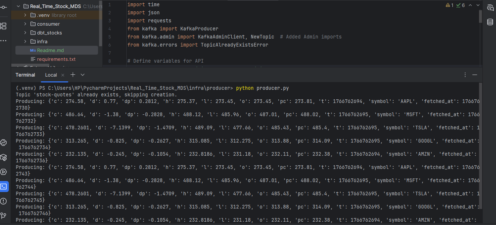
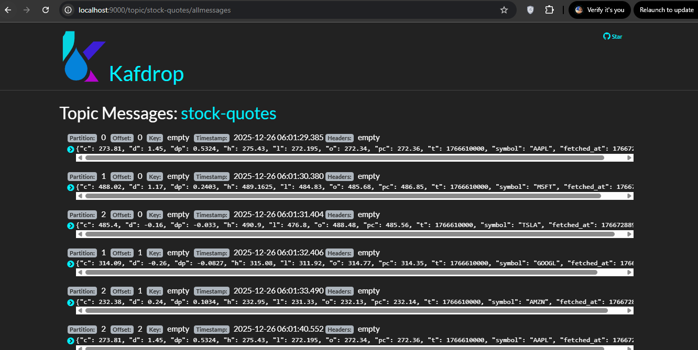
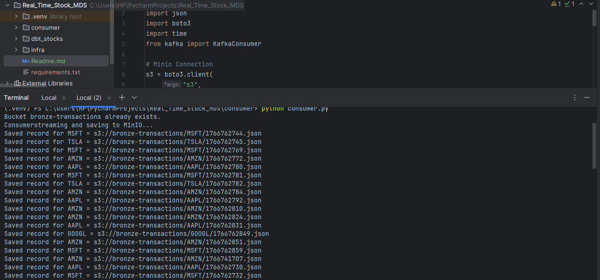
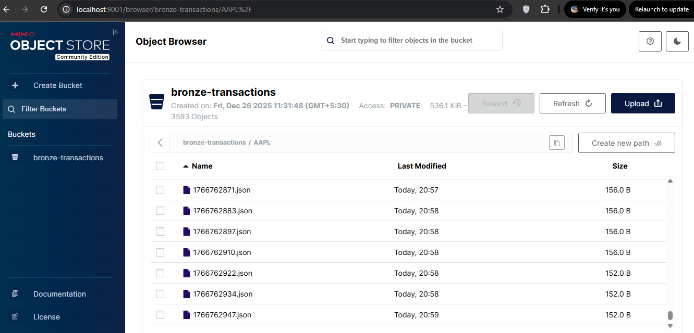
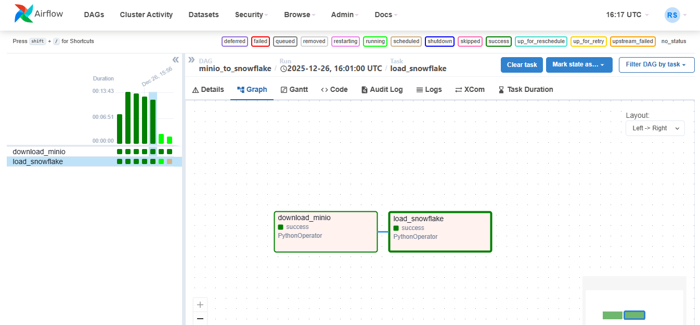
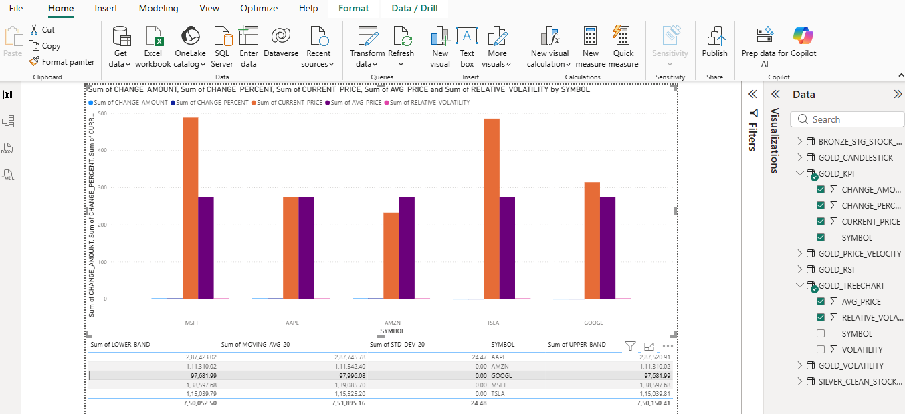

# 📈 Real-Time-Stock-Market-Streaming-Data-Pipeline
**Bridging the gap between volatile live market streams and actionable warehouse analytics.**
## The Mission
Modern stock markets generate millions of data points every second. This project was built to address the challenge of ingesting high-velocity, real-time "ticker" data from external APIs and transforming it into a structured, analytics-ready format. By implementing a modular "Medal" architecture (Bronze-Silver-Gold), the pipeline ensures data integrity, scalability, and sub-minute latency for financial decision-making.

## The Architecture Blueprint
🎨 **End-to-End Schematic**
* **Ingestion:** Real-time stock quotes are polled from the external API via a Python-based Producer.
* **Streaming Layer:** Apache Kafka acts as the central nervous system, decoupling the high-frequency API ingestion from downstream storage.
* **Object Storage (Bronze):** A Python Consumer persists raw JSON blobs into MinIO (S3-compatible) to create an immutable record of historical data.
*  **Orchestration:** Apache Airflow schedules the transfer of data from MinIO into Snowflake, ensuring that new records are loaded every minute.
*  Warehouse Strategy:** Data is organized into a Medal Architecture within Snowflake, with transformations managed by dbt.

🚀 **The Data Journey: Ticker to Table**

To ensure reliability and performance, the pipeline follows a structured three-stage path:

| Stage                 |        Process        |                                                                    Outcome                                                                     |
|:----------------------|:---------------------:|:----------------------------------------------------------------------------------------------------------------------------------------------:|
| **1. The Stream**     |  **Python → Kafka**   |                            Live market ticks are captured and buffered, preventing data loss during traffic spikes.                            |
| **2. The Landing**    |   **Kafka → MinIO**   | Data lands in the **Bronze Layer** as raw JSON. This "Data Lake" approach ensures we can re-process historical data if business logic changes. |
| **3. The Refinement** | **MinIO → Snowflake** |                Airflow triggers the **COPY INTO** command to move data from object storage into Snowflake's structured tables.                 |

## Tech Stack & Database Design

This project utilizes a **Modern Data Stack** designed for high availability and modularity. Tools are categorized by their specific role in the data lifecycle.

🛠️ **Technology Stack by Capability**

| Category | Purpose |
|:----------------------|:---------------------:|
| **Ingestion & Streaming**     | Real-time polling from Finnhub API and message buffering. |
| **Object Storage**    | S3-compatible storage for raw JSON landing (Bronze layer). |
| **Data Warehouse** | Scalable compute and storage for multi-tier data modeling. |
| **Transformation** | SQL-based ELT to refine raw data into analytical models. |
| **Orchestration** | Managing dependencies between MinIO downloads and Snowflake loads. |
| **Infrastructure** | Containerization for consistent environment deployment. |
| **Visualization** | Interactive dashboards for real-time stock market insights. |

🏗️ **The Medal Schema (Snowflake + dbt)**

I have implemented a **Medal Architecture** to ensure data quality and lineage throughout the pipeline. This structure allows for both raw data auditability and high-performance reporting.

* 🟫 **Bronze Layer (Raw):**
    * **Source:** MinIO JSON files loaded via COPY INTO.
    * **Format:** One-to-one mapping of the raw API response.
    * **Value:** Serves as a "Source of Truth" for troubleshooting and re-processing.
* 🥈 **Silver Layer (Cleaned):**
    * **Process:** Managed by dbt models.
    * **Actions:** Type casting (converting strings to timestamps/floats), deduplication, and filtering out null market ticks.
    * **Value:** A reliable, standardized dataset for general querying.
* 🥇 **Gold Layer (Analytics):**
    * **Process:** Aggregated views created with dbt.
    * **Output:** Tables optimized for BI, such as kpis, candlestick, treechart, volatility metrics, etc.
    * **Value:** Final high-performance tables used directly by **Power BI** for real-time visualization.

    **Design Insight:** By using **dbt** to manage these layers, the pipeline benefits from version-controlled SQL and automated testing, ensuring that only "clean" data reaches the Gold layer.

## ⚙️ Workflow Summary & Visualization

**Producer & Kafka Streaming Through Finnhub API:**
  

**Consumer & Storage (MinIO Object Storage):**
  

**Apache Airflow:**

**Snowflake:**

**Docker Containerization:**

**PowerBI Dashboard:**
